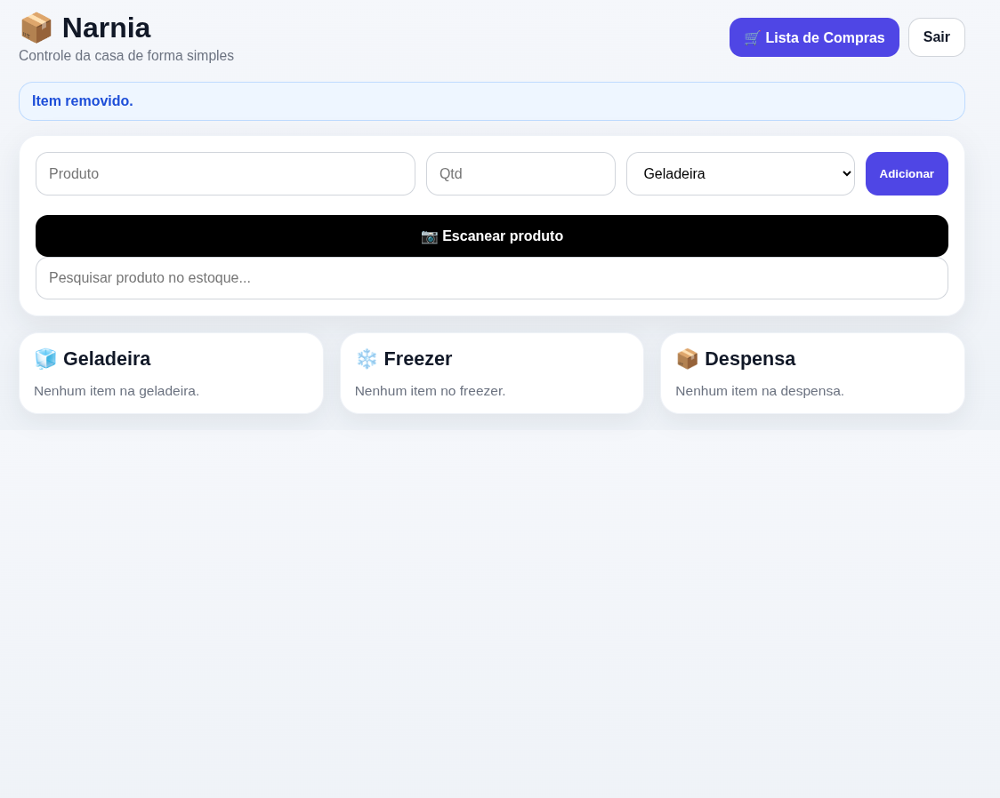

# 📦 Narnia — Controle de Estoque Doméstico

Sistema simples e intuitivo para **organizar o estoque da casa**, permitindo controlar alimentos e produtos armazenados em locais como **geladeira, freezer e despensa**.

---

## 🖥️ Demonstração



---

## ✨ Funcionalidades

- 📦 Cadastro rápido de produtos
- ❄️ Organização por locais:
  - Geladeira
  - Freezer
  - Despensa
- ➕ Aumentar quantidade
- ➖ Diminuir quantidade
- 🗑️ Remover produtos
- 🔍 Pesquisa de itens no estoque
- 🛒 Lista de compras integrada
- 📷 Escaneamento de produtos

---

## 🎯 Objetivo do Projeto

O **Narnia** foi criado para facilitar o controle do que existe dentro de casa, evitando:

- desperdício de alimentos  
- compras duplicadas  
- perda de produtos esquecidos  

Tudo em uma **interface simples e rápida de usar**.

---

## 🛠️ Tecnologias

O sistema foi desenvolvido utilizando:

- HTML
- CSS
- JavaScript
- Python (backend)
- Nginx
- Ubuntu Server

---

## 🚀 Instalação

Clone o repositório:

```bash
git clone https://github.com/holanda05/narnia-estoque.git
